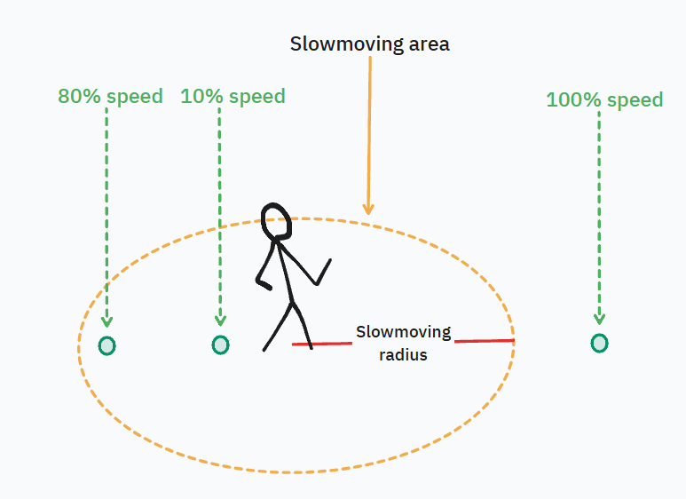

Ok, lets keep camera on client and manipulate it only on client

But if we keep camera on client, we calculate the spot on client too. Yes. And we don't need to pass
window height&width to server.

So, let's make it in the following way:
When client connects to the server, server gets free player ID and sends it to client.

Then server sends to the client list of all players, and client itself connects camera to his player-id coordinates, calculates the cursor spot and sends it back to server.

# Controlling your player
## Movement:
The player's movement is controlled by mouse - your player will run after your mouse's cursor.

Depending on your 'slowmoving area radius' settings, the closer the mouse cursor is to your player, the slower he will move.

